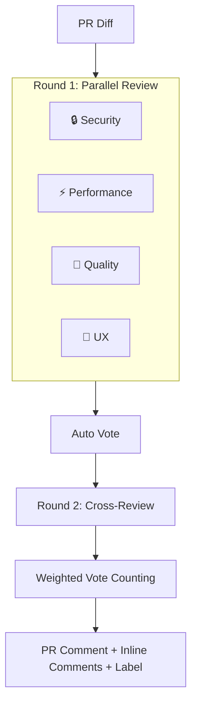

# 🔍 simple-review-bot

> AI Code Review Bot — Multi-perspective review + Voting + Cross-review debate

📖 [한국어 문서 (Korean)](./README_KO.md)

Four expert agents review your PR **in parallel**, cross-validate each other's findings, and deliver high-confidence code reviews with inline comments.

## ✨ Features

### 🤖 4 Agent Perspectives

- **🔒 Security** — Hardcoded secrets, injection, XSS, auth gaps
- **⚡ Performance** — O(n²), N+1, memory leaks, caching
- **🧹 Quality** — Naming, DRY, error handling, SOLID principles
- **🎨 UX** — Loading states, a11y, empty states, responsive design

### 📊 Voting System

Agents automatically vote based on issue severity:

- ✅ **approve** — No critical issues
- ⚠️ **conditional** (0.5 vote) — Warnings present
- ❌ **reject** — Critical issue(s) found

### ⚖️ Weighted Scoring

Automatically adjusts agent weights based on PR file types:

<table>
<tr>
  <th>PR Type</th><th>Security</th><th>Performance</th><th>Quality</th><th>UX</th>
</tr>
<tr>
  <td>Frontend (<code>.tsx</code>, <code>.css</code>)</td><td>×1.0</td><td>×0.8</td><td>×1.0</td><td><b>×1.5</b></td>
</tr>
<tr>
  <td>Backend (<code>.ts</code>, <code>.sql</code>)</td><td><b>×1.5</b></td><td>×1.2</td><td>×1.0</td><td>×0.5</td>
</tr>
<tr>
  <td>Infra (<code>.yml</code>, <code>.tf</code>)</td><td><b>×2.0</b></td><td>×0.5</td><td>×1.0</td><td>×0.3</td>
</tr>
</table>

### 💬 Cross-Review Debate (Enabled by Default)

Agents cross-validate each other's findings:

1. **Round 1** — Independent review (4 agents in parallel, max 3 issues per agent)
2. **Round 2** — Cross-review (each agent evaluates others' issues with agree/disagree/abstain)

→ Per-issue **confidence score** — issues below 50% confidence are filtered out automatically

### 📝 PR Summary

Automatically generates a concise summary of PR changes using LLM. Respects the `output.language` setting. Also generated for deletion-only PRs.

### 📌 Inline Review Comments

High-confidence issues are posted as **inline comments directly on the code** (not just a single big comment). The bot always uses `COMMENT` review event (never `REQUEST_CHANGES`), so it won't block your PR — human reviewers decide to approve or reject.

### 🎯 Strict Severity Criteria

Agents follow strict severity guidelines:

- 🔴 **critical** — Immediately exploitable (injection, auth bypass) or will cause bugs/crashes
- 🟡 **warning** — Needs attention but not immediately dangerous (missing validation, memory leak potential)
- 💡 **info** — Minor suggestion or best practice

Agents do NOT suggest architecture changes (e.g., "use Redis") — they only review the code as written.

### 🏷️ Auto Labels

Automatically applies PR labels based on vote results:

- `review:approved` 🟢
- `review:changes-requested` 🔴
- `review:needs-discussion` 🟡

### 🔄 Re-Review via Comment

Type `/review` in a PR comment to re-trigger the review.

### 🚫 Hard Cut

Automatically skips review for oversized PRs (default: 300 files or 10,000 lines). Deletion-only files are also skipped (no point reviewing removed code).

---

## 🚀 Quick Start

```yaml
# .github/workflows/review.yml
name: AI Code Review
on:
  pull_request:
    types: [opened, synchronize]
  issue_comment:
    types: [created]  # For /review re-trigger

permissions:
  contents: read
  pull-requests: write

jobs:
  review:
    runs-on: ubuntu-latest
    if: |
      github.event_name == 'pull_request' ||
      (github.event_name == 'issue_comment' &&
       github.event.issue.pull_request &&
       contains(github.event.comment.body, '/review'))
    steps:
      - uses: actions/checkout@v4
      - uses: minjihan/simple-review-bot@v1
        with:
          openai_api_key: ${{ secrets.OPENAI_API_KEY }}
        env:
          GITHUB_TOKEN: ${{ secrets.GITHUB_TOKEN }}
```

### Provider Options

```yaml
# OpenAI (default)
- uses: minjihan/simple-review-bot@v1
  with:
    openai_api_key: ${{ secrets.OPENAI_API_KEY }}

# Claude
- uses: minjihan/simple-review-bot@v1
  with:
    provider: claude
    claude_api_key: ${{ secrets.CLAUDE_API_KEY }}

# Gemini
- uses: minjihan/simple-review-bot@v1
  with:
    provider: gemini
    gemini_api_key: ${{ secrets.GEMINI_API_KEY }}

# Gemini via GCP Vertex AI (no API key needed)
- uses: google-github-actions/auth@v2
  with:
    credentials_json: ${{ secrets.GCP_SA_KEY }}
- uses: minjihan/simple-review-bot@v1
  with:
    provider: gemini
    gcp_project: ${{ secrets.GCP_PROJECT_ID }}
  env:
    GITHUB_TOKEN: ${{ secrets.GITHUB_TOKEN }}
```

---

## ⚙️ Configuration

Create `.github/pr-lens.yml` for advanced settings:

```yaml
# LLM Provider
provider:
  type: openai
  model: gpt-4o

# Agent configuration (boolean or object)
agents:
  security: true
  performance: true
  quality:
    enabled: true
    model: gpt-4o-mini        # Per-agent model override
  ux:
    enabled: true
    provider: gemini           # Per-agent provider
    model: gemini-2.5-flash

# Tiered model selection (auto-select model by diff size)
tiered_model:
  enabled: true

# Hard cut — skip oversized PRs
hard_cut:
  enabled: true
  max_changed_files: 300
  max_changed_lines: 10000

# PR summary generation
summary:
  enabled: true

# Voting
voting:
  required_approvals: 2
  conditional_weight: 0.5

# Cross-review debate (enabled by default)
debate:
  enabled: true          # default: true
  trigger: always        # always | on-critical | on-disagreement (default: always)

# Auto weight detection
weights:
  auto_detect: true

# Auto labels
labels:
  enabled: true
  approved: "review:approved"
  rejected: "review:changes-requested"
  discussion: "review:needs-discussion"

# Output style
output:
  style: detailed # detailed | summary
  language: ko    # en, ko, ja, zh, es, fr, de, pt

# Ignore patterns
ignore:
  files:
    - "*.lock"
    - "*.generated.*"
  paths:
    - "node_modules/"
    - "dist/"
```

### 🎨 Custom Prompt Guidelines

Create `.github/review-bot/` to customize agent prompts:

```
.github/review-bot/
├── common.md        # Appended to ALL agents
├── security.md      # Replaces Security agent prompt
├── performance.md   # Replaces Performance agent prompt
├── quality.md       # Replaces Quality agent prompt
└── ux.md            # Replaces UX agent prompt
```

Priority:
1. Agent-specific `.md` (if exists) → **replaces** built-in prompt
2. Built-in prompt (fallback)
3. `common.md` → **always appended** to all agents

Example `common.md`:
```markdown
# Team Guidelines
- This is an e-commerce platform
- All APIs follow REST conventions
- Error codes use ERR_ prefix
- Korean comments are acceptable
```

---

## 📊 Output Example

> Below is an example of the review comment posted on your PR:

<table>
<tr><td colspan="5"><h3>🔍 simple-review-bot Review</h3></td></tr>
<tr><td colspan="5">📝 <b>PR Summary</b>: Added user authentication with JWT tokens and rate limiting</td></tr>
<tr><td colspan="5">✅ <b>APPROVED</b> (3.2 / 4.0 weighted votes)</td></tr>
<tr>
  <th>Agent</th><th>Vote</th><th>Weight</th><th>Issues</th><th>Score</th>
</tr>
<tr>
  <td>🔒 Security</td><td>✅ approve</td><td>×1.5</td><td>None</td><td>1.5</td>
</tr>
<tr>
  <td>⚡ Performance</td><td>⚠️ conditional</td><td>×1.2</td><td>1 warning</td><td>0.6</td>
</tr>
<tr>
  <td>🧹 Quality</td><td>✅ approve</td><td>×1.0</td><td>1 info</td><td>1.0</td>
</tr>
<tr>
  <td>🎨 UX</td><td>❌ reject</td><td>×0.5</td><td>1 critical</td><td>0.0</td>
</tr>
<tr><td colspan="5"><code>▓▓▓▓▓▓▓▓▓▓▓▓▓▓▓▓░░░░</code> 80% approval score</td></tr>
</table>

**📋 Action Items**

- [ ] Refactor nested loop in `src/utils.ts:15` (⚡ Performance)

---

## 🏗️ Architecture



---

## 🔧 Development

```bash
pnpm install          # Install dependencies
pnpm dev              # Watch mode
pnpm typecheck        # Type check
pnpm build            # Build with ncc
```

## 📁 Project Structure

```
simple-review-bot/
├── action.yml              # GitHub Action definition
├── src/
│   ├── index.ts            # Main entry point
│   ├── agents/             # 4 review agents + BaseAgent
│   ├── providers/          # LLM providers (OpenAI / Claude / Gemini)
│   │   └── tiered-model.ts # Auto model selection by diff size
│   ├── review/             # Voting + debate + summary
│   ├── github/             # GitHub API (comments, inline reviews, labels)
│   └── utils/              # Config, guidelines, errors, retry, logger
└── dist/                   # Bundled output
```

## 📝 License

MIT
