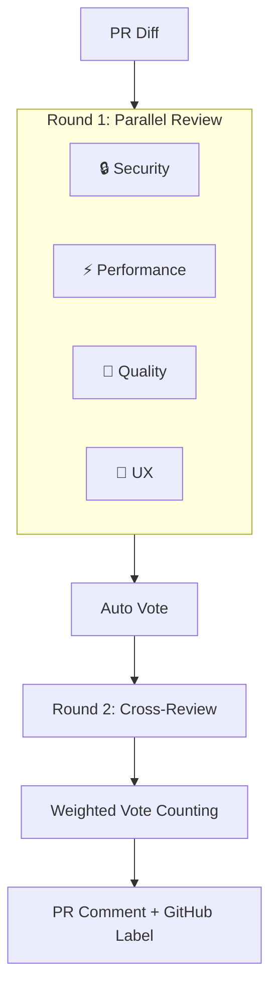

# 🔍 simple-review-bot

> AI Code Review Bot — Multi-perspective review + Voting + Cross-review debate

📖 [한국어 문서 (Korean)](./README_KO.md)

Four expert agents review your PR **in parallel**, then cross-validate each other's findings to deliver high-confidence code reviews.

## ✨ Features

### 🤖 4 Agent Perspectives

- **🔒 Security** — Hardcoded secrets, injection, XSS, auth gaps
- **⚡ Performance** — O(n²), N+1, memory leaks, caching
- **🧹 Quality** — Naming, DRY, error handling, SOLID principles
- **🎨 UX** — Loading states, a11y, empty states, responsive design

### 📊 Voting System

Agents automatically vote based on issue severity:

- ✅ **approve** — No critical issues
- ⚠️ **conditional** (0.5 vote) — Warnings present
- ❌ **reject** — Critical issue(s) found

### ⚖️ Weighted Scoring

Automatically adjusts agent weights based on PR file types:

<table>
<tr>
  <th>PR Type</th><th>Security</th><th>Performance</th><th>Quality</th><th>UX</th>
</tr>
<tr>
  <td>Frontend (<code>.tsx</code>, <code>.css</code>)</td><td>×1.0</td><td>×0.8</td><td>×1.0</td><td><b>×1.5</b></td>
</tr>
<tr>
  <td>Backend (<code>.ts</code>, <code>.sql</code>)</td><td><b>×1.5</b></td><td>×1.2</td><td>×1.0</td><td>×0.5</td>
</tr>
<tr>
  <td>Infra (<code>.yml</code>, <code>.tf</code>)</td><td><b>×2.0</b></td><td>×0.5</td><td>×1.0</td><td>×0.3</td>
</tr>
</table>

### 💬 Cross-Review Debate

Agents cross-validate each other's findings:

1. **Round 1** — Independent review (4 agents in parallel)
2. **Round 2** — Cross-review (each agent evaluates others' issues with agree/disagree/abstain)

→ Per-issue **confidence score** (reduces false positives)

### 🏷️ Auto Labels

Automatically applies PR labels based on vote results:

- `review:approved` 🟢
- `review:changes-requested` 🔴
- `review:needs-discussion` 🟡

---

## 🚀 Quick Start

```yaml
# .github/workflows/review.yml
name: AI Code Review
on:
  pull_request:
    types: [opened, synchronize]

permissions:
  contents: read
  pull-requests: write

jobs:
  review:
    runs-on: ubuntu-latest
    steps:
      - uses: actions/checkout@v4
      - uses: minjihan/simple-review-bot@v1
        with:
          openai_api_key: ${{ secrets.OPENAI_API_KEY }}
        env:
          GITHUB_TOKEN: ${{ secrets.GITHUB_TOKEN }}
```

### Provider Options

```yaml
# OpenAI (default)
- uses: minjihan/simple-review-bot@v1
  with:
    openai_api_key: ${{ secrets.OPENAI_API_KEY }}

# Claude
- uses: minjihan/simple-review-bot@v1
  with:
    provider: claude
    claude_api_key: ${{ secrets.CLAUDE_API_KEY }}

# Gemini
- uses: minjihan/simple-review-bot@v1
  with:
    provider: gemini
    gemini_api_key: ${{ secrets.GEMINI_API_KEY }}
```

---

## ⚙️ Configuration

Create `.github/pr-lens.yml` for advanced settings:

```yaml
# LLM Provider
provider:
  type: openai
  model: gpt-4o

# Enable/disable agents
agents:
  security: true
  performance: true
  quality: true
  ux: false # Disable for backend-only repos

# Voting
voting:
  required_approvals: 2
  conditional_weight: 0.5

# Cross-review debate
debate:
  enabled: true
  trigger: on-critical # always | on-critical | on-disagreement

# Auto weight detection
weights:
  auto_detect: true

# Auto labels
labels:
  enabled: true
  approved: "review:approved"
  rejected: "review:changes-requested"
  discussion: "review:needs-discussion"

# Output style
output:
  style: detailed # detailed | summary

# Ignore patterns
ignore:
  files:
    - "*.lock"
    - "*.generated.*"
  paths:
    - "node_modules/"
    - "dist/"
```

---

## 📊 Output Example

> Below is an example of the review comment posted on your PR:

<table>
<tr><td colspan="5"><h3>🔍 simple-review-bot Review</h3></td></tr>
<tr><td colspan="5">✅ <b>APPROVED</b> (3.2 / 4.0 weighted votes)</td></tr>
<tr>
  <th>Agent</th><th>Vote</th><th>Weight</th><th>Issues</th><th>Score</th>
</tr>
<tr>
  <td>🔒 Security</td><td>✅ approve</td><td>×1.5</td><td>None</td><td>1.5</td>
</tr>
<tr>
  <td>⚡ Performance</td><td>⚠️ conditional</td><td>×1.2</td><td>1 warning</td><td>0.6</td>
</tr>
<tr>
  <td>🧹 Quality</td><td>✅ approve</td><td>×1.0</td><td>1 info</td><td>1.0</td>
</tr>
<tr>
  <td>🎨 UX</td><td>❌ reject</td><td>×0.5</td><td>1 critical</td><td>0.0</td>
</tr>
<tr><td colspan="5"><code>▓▓▓▓▓▓▓▓▓▓▓▓▓▓▓▓░░░░</code> 80% confidence</td></tr>
</table>

**📋 Action Items**

- [ ] Refactor nested loop in `src/utils.ts:15` (⚡ Performance)

---

## 🏗️ Architecture



---

## 🔧 Development

```bash
pnpm install          # Install dependencies
pnpm dev              # Watch mode
pnpm typecheck        # Type check
pnpm build            # Build with ncc
```

## 📁 Project Structure

```
simple-review-bot/
├── action.yml              # GitHub Action definition
├── src/
│   ├── index.ts            # Main entry point
│   ├── agents/             # 4 review agents
│   ├── providers/          # LLM providers (OpenAI / Claude / Gemini)
│   ├── review/             # Voting + debate system
│   ├── github/             # GitHub API integration
│   └── utils/              # Config, errors, retry, logger
└── dist/                   # Bundled output
```

## 📝 License

MIT
