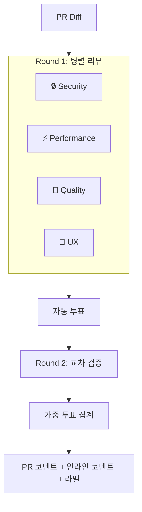

# 🔍 simple-review-bot

> AI 코드 리뷰 봇 — 다중 관점 리뷰 + 투표 + 교차 검증 토론

📖 [English](./README.md)

4명의 전문 에이전트가 PR을 **병렬로 리뷰**하고, 서로의 발견을 교차 검증하여 높은 신뢰도의 코드 리뷰를 인라인 코멘트와 함께 제공합니다.

## ✨ 기능

### 🤖 4개 에이전트 관점

- **🔒 Security** — 하드코딩된 시크릿, 인젝션, XSS, 인증 취약점
- **⚡ Performance** — O(n²), N+1, 메모리 누수, 캐싱
- **🧹 Quality** — 네이밍, DRY, 에러 핸들링, SOLID 원칙
- **🎨 UX** — 로딩 상태, 접근성, 빈 상태, 반응형 디자인

### 📊 투표 시스템

에이전트가 이슈 심각도에 따라 자동 투표:

- ✅ **approve** — 심각한 이슈 없음
- ⚠️ **conditional** (0.5표) — 경고 존재
- ❌ **reject** — 치명적 이슈 발견

### ⚖️ 가중치 스코어링

PR 파일 유형에 따라 에이전트 가중치 자동 조정:

<table>
<tr>
  <th>PR 유형</th><th>Security</th><th>Performance</th><th>Quality</th><th>UX</th>
</tr>
<tr>
  <td>프론트엔드 (<code>.tsx</code>, <code>.css</code>)</td><td>×1.0</td><td>×0.8</td><td>×1.0</td><td><b>×1.5</b></td>
</tr>
<tr>
  <td>백엔드 (<code>.ts</code>, <code>.sql</code>)</td><td><b>×1.5</b></td><td>×1.2</td><td>×1.0</td><td>×0.5</td>
</tr>
<tr>
  <td>인프라 (<code>.yml</code>, <code>.tf</code>)</td><td><b>×2.0</b></td><td>×0.5</td><td>×1.0</td><td>×0.3</td>
</tr>
</table>

### 💬 교차 검증 토론

에이전트가 서로의 발견을 교차 검증:

1. **Round 1** — 독립 리뷰 (4개 에이전트 병렬)
2. **Round 2** — 교차 검증 (각 에이전트가 다른 에이전트의 이슈에 agree/disagree/abstain)

→ 이슈별 **confidence score** (거짓 양성 감소)

### 📝 PR 요약

LLM을 사용하여 PR 변경사항의 간결한 요약을 자동 생성합니다.

### 📌 인라인 리뷰 코멘트

신뢰도 높은 이슈는 **코드에 직접 인라인 코멘트**로 게시됩니다. 토론 후 confidence ≥ 50% 이슈만 인라인 코멘트가 달립니다.

### 🏷️ 자동 라벨

투표 결과에 따라 PR 라벨 자동 적용:

- `review:approved` 🟢
- `review:changes-requested` 🔴
- `review:needs-discussion` 🟡

### 🔄 코멘트로 재리뷰

PR 코멘트에 `/review`를 입력하면 리뷰를 다시 실행합니다.

### 🚫 Hard Cut

대형 PR 자동 스킵 (기본값: 파일 300개 또는 변경 10,000줄 초과).

---

## 🚀 빠른 시작

```yaml
# .github/workflows/review.yml
name: AI Code Review
on:
  pull_request:
    types: [opened, synchronize]
  issue_comment:
    types: [created]  # /review 재트리거용

permissions:
  contents: read
  pull-requests: write

jobs:
  review:
    runs-on: ubuntu-latest
    if: |
      github.event_name == 'pull_request' ||
      (github.event_name == 'issue_comment' &&
       github.event.issue.pull_request &&
       contains(github.event.comment.body, '/review'))
    steps:
      - uses: actions/checkout@v4
      - uses: minjihan/simple-review-bot@v1
        with:
          openai_api_key: ${{ secrets.OPENAI_API_KEY }}
        env:
          GITHUB_TOKEN: ${{ secrets.GITHUB_TOKEN }}
```

### 프로바이더 옵션

```yaml
# OpenAI (기본)
- uses: minjihan/simple-review-bot@v1
  with:
    openai_api_key: ${{ secrets.OPENAI_API_KEY }}

# Claude
- uses: minjihan/simple-review-bot@v1
  with:
    provider: claude
    claude_api_key: ${{ secrets.CLAUDE_API_KEY }}

# Gemini
- uses: minjihan/simple-review-bot@v1
  with:
    provider: gemini
    gemini_api_key: ${{ secrets.GEMINI_API_KEY }}

# Gemini via GCP Vertex AI (API 키 불필요)
- uses: google-github-actions/auth@v2
  with:
    credentials_json: ${{ secrets.GCP_SA_KEY }}
- uses: minjihan/simple-review-bot@v1
  with:
    provider: gemini
    gcp_project: ${{ secrets.GCP_PROJECT_ID }}
  env:
    GITHUB_TOKEN: ${{ secrets.GITHUB_TOKEN }}
```

---

## ⚙️ 설정

`.github/pr-lens.yml`로 고급 설정:

```yaml
# LLM 프로바이더
provider:
  type: openai
  model: gpt-4o

# 에이전트 설정 (boolean 또는 객체)
agents:
  security: true
  performance: true
  quality:
    enabled: true
    model: gpt-4o-mini        # 에이전트별 모델 오버라이드
  ux:
    enabled: true
    provider: gemini           # 에이전트별 프로바이더
    model: gemini-2.5-flash

# 티어드 모델 (diff 크기에 따라 자동 모델 선택)
tiered_model:
  enabled: true

# Hard Cut — 대형 PR 스킵
hard_cut:
  enabled: true
  max_changed_files: 300
  max_changed_lines: 10000

# PR 요약 생성
summary:
  enabled: true

# 투표
voting:
  required_approvals: 2
  conditional_weight: 0.5

# 교차 검증 토론
debate:
  enabled: true
  trigger: on-critical # always | on-critical | on-disagreement

# 자동 가중치 감지
weights:
  auto_detect: true

# 자동 라벨
labels:
  enabled: true
  approved: "review:approved"
  rejected: "review:changes-requested"
  discussion: "review:needs-discussion"

# 출력 스타일
output:
  style: detailed # detailed | summary

# 무시 패턴
ignore:
  files:
    - "*.lock"
    - "*.generated.*"
  paths:
    - "node_modules/"
    - "dist/"
```

### 🎨 커스텀 프롬프트 가이드라인

`.github/review-bot/`에 마크다운 파일로 에이전트 프롬프트를 커스텀:

```
.github/review-bot/
├── common.md        # 모든 에이전트에 추가
├── security.md      # Security 에이전트 프롬프트 교체
├── performance.md   # Performance 에이전트 프롬프트 교체
├── quality.md       # Quality 에이전트 프롬프트 교체
└── ux.md            # UX 에이전트 프롬프트 교체
```

우선순위:
1. 에이전트별 `.md` (존재하면) → 내장 프롬프트 **교체**
2. 내장 프롬프트 (폴백)
3. `common.md` → 모든 에이전트에 **항상 추가**

`common.md` 예시:
```markdown
# 팀 가이드라인
- 이커머스 플랫폼 프로젝트
- 모든 API는 REST 컨벤션 사용
- 에러 코드는 ERR_ 접두사 사용
- 한국어 주석 허용
```

---

## 📊 출력 예시

<table>
<tr><td colspan="5"><h3>🔍 simple-review-bot Review</h3></td></tr>
<tr><td colspan="5">📝 <b>PR Summary</b>: JWT 토큰과 Rate Limiting을 사용한 사용자 인증 추가</td></tr>
<tr><td colspan="5">✅ <b>APPROVED</b> (3.2 / 4.0 가중 투표)</td></tr>
<tr>
  <th>에이전트</th><th>투표</th><th>가중치</th><th>이슈</th><th>점수</th>
</tr>
<tr>
  <td>🔒 Security</td><td>✅ approve</td><td>×1.5</td><td>None</td><td>1.5</td>
</tr>
<tr>
  <td>⚡ Performance</td><td>⚠️ conditional</td><td>×1.2</td><td>1 warning</td><td>0.6</td>
</tr>
<tr>
  <td>🧹 Quality</td><td>✅ approve</td><td>×1.0</td><td>1 info</td><td>1.0</td>
</tr>
<tr>
  <td>🎨 UX</td><td>❌ reject</td><td>×0.5</td><td>1 critical</td><td>0.0</td>
</tr>
<tr><td colspan="5"><code>▓▓▓▓▓▓▓▓▓▓▓▓▓▓▓▓░░░░</code> 80% confidence</td></tr>
</table>

**📋 액션 아이템**

- [ ] `src/utils.ts:15`의 중첩 루프 리팩토링 (⚡ Performance)

---

## 🏗️ 아키텍처



---

## 🔧 개발

```bash
pnpm install          # 의존성 설치
pnpm dev              # 감시 모드
pnpm typecheck        # 타입 체크
pnpm build            # ncc 빌드
```

## 📁 프로젝트 구조

```
simple-review-bot/
├── action.yml              # GitHub Action 정의
├── src/
│   ├── index.ts            # 메인 진입점
│   ├── agents/             # 4개 리뷰 에이전트 + BaseAgent
│   ├── providers/          # LLM 프로바이더 (OpenAI / Claude / Gemini)
│   │   └── tiered-model.ts # diff 크기 기반 자동 모델 선택
│   ├── review/             # 투표 + 토론 + 요약
│   ├── github/             # GitHub API (코멘트, 인라인 리뷰, 라벨)
│   └── utils/              # 설정, 가이드라인, 에러, 재시도, 로거
└── dist/                   # 번들된 출력
```

## 📝 라이선스

MIT
