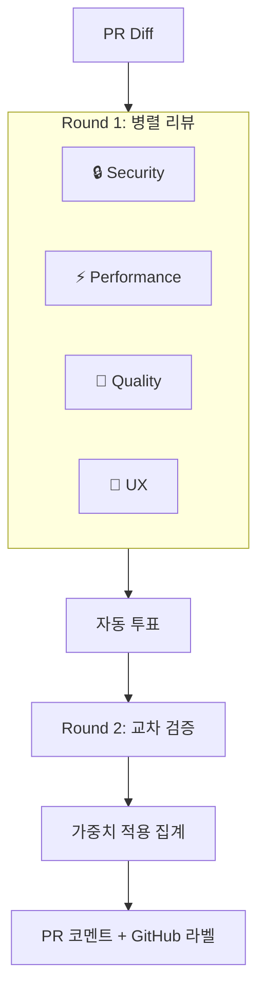

# 🔍 simple-review-bot

> AI 코드 리뷰 봇 — 다중 관점 리뷰 + 투표 + 교차 검증

📖 [English](./README.md)

4개의 전문 에이전트가 PR을 **병렬로** 리뷰하고, 교차 검증을 통해 신뢰도 높은 코드 리뷰를 제공합니다.

## ✨ 기능

### 🤖 4개 에이전트

- **🔒 Security** — 시크릿 노출, 인젝션, XSS, 인증 취약점
- **⚡ Performance** — O(n²), N+1, 메모리 누수, 캐싱
- **🧹 Quality** — 네이밍, DRY, 에러 핸들링, SOLID 원칙
- **🎨 UX** — 로딩 상태, 접근성, 빈 상태, 반응형 디자인

### 📊 투표 시스템

이슈 심각도에 따라 에이전트가 자동 투표:

- ✅ **approve** — critical 이슈 없음
- ⚠️ **conditional** (0.5표) — warning 존재
- ❌ **reject** — critical 이슈 발견

### ⚖️ 가중치 시스템

PR 파일 유형을 분석하여 에이전트별 가중치 자동 조정:

<table>
<tr>
  <th>PR 유형</th><th>Security</th><th>Performance</th><th>Quality</th><th>UX</th>
</tr>
<tr>
  <td>Frontend (<code>.tsx</code>, <code>.css</code>)</td><td>×1.0</td><td>×0.8</td><td>×1.0</td><td><b>×1.5</b></td>
</tr>
<tr>
  <td>Backend (<code>.ts</code>, <code>.sql</code>)</td><td><b>×1.5</b></td><td>×1.2</td><td>×1.0</td><td>×0.5</td>
</tr>
<tr>
  <td>Infra (<code>.yml</code>, <code>.tf</code>)</td><td><b>×2.0</b></td><td>×0.5</td><td>×1.0</td><td>×0.3</td>
</tr>
</table>

### 💬 교차 검증 (Debate)

에이전트들이 서로의 이슈를 검증:

1. **Round 1** — 독립 리뷰 (4개 에이전트 병렬 실행)
2. **Round 2** — 교차 검증 (각 에이전트가 다른 에이전트의 이슈에 동의/반대/의견없음)

→ 이슈별 **신뢰도 점수** 산출 (false positive 감소)

### 🏷️ 자동 라벨

투표 결과에 따라 PR에 자동 라벨 적용:

- `review:approved` 🟢
- `review:changes-requested` 🔴
- `review:needs-discussion` 🟡

---

## 🚀 시작하기

```yaml
# .github/workflows/review.yml
name: AI Code Review
on:
  pull_request:
    types: [opened, synchronize]

permissions:
  contents: read
  pull-requests: write

jobs:
  review:
    runs-on: ubuntu-latest
    steps:
      - uses: actions/checkout@v4
      - uses: minjihan/simple-review-bot@v1
        with:
          openai_api_key: ${{ secrets.OPENAI_API_KEY }}
        env:
          GITHUB_TOKEN: ${{ secrets.GITHUB_TOKEN }}
```

### Provider 선택

```yaml
# OpenAI (기본)
- uses: minjihan/simple-review-bot@v1
  with:
    openai_api_key: ${{ secrets.OPENAI_API_KEY }}

# Claude
- uses: minjihan/simple-review-bot@v1
  with:
    provider: claude
    claude_api_key: ${{ secrets.CLAUDE_API_KEY }}

# Gemini
- uses: minjihan/simple-review-bot@v1
  with:
    provider: gemini
    gemini_api_key: ${{ secrets.GEMINI_API_KEY }}
```

---

## ⚙️ 설정

`.github/pr-lens.yml` 파일로 상세 설정:

```yaml
# LLM Provider
provider:
  type: openai
  model: gpt-4o # 모델 지정 (선택)

# 에이전트 활성화/비활성화
agents:
  security: true
  performance: true
  quality: true
  ux: false # 백엔드 전용 레포에서 비활성화

# 투표 설정
voting:
  required_approvals: 2 # 필요 찬성 표
  conditional_weight: 0.5

# 교차 검증
debate:
  enabled: true
  trigger: on-critical # always | on-critical | on-disagreement

# 가중치
weights:
  auto_detect: true # 파일 확장자 기반 자동 감지

# 자동 라벨
labels:
  enabled: true
  approved: "review:approved"
  rejected: "review:changes-requested"
  discussion: "review:needs-discussion"

# 출력 스타일
output:
  style: detailed # detailed | summary

# 무시할 파일/경로
ignore:
  files:
    - "*.lock"
    - "*.generated.*"
  paths:
    - "node_modules/"
    - "dist/"
```

---

## 📊 출력 예시

> 아래는 PR에 포스팅되는 리뷰 코멘트 예시입니다:

<table>
<tr><td colspan="5"><h3>🔍 simple-review-bot Review</h3></td></tr>
<tr><td colspan="5">✅ <b>APPROVED</b> (3.2 / 4.0 weighted votes)</td></tr>
<tr>
  <th>Agent</th><th>Vote</th><th>Weight</th><th>Issues</th><th>Score</th>
</tr>
<tr>
  <td>🔒 Security</td><td>✅ approve</td><td>×1.5</td><td>None</td><td>1.5</td>
</tr>
<tr>
  <td>⚡ Performance</td><td>⚠️ conditional</td><td>×1.2</td><td>1 warning</td><td>0.6</td>
</tr>
<tr>
  <td>🧹 Quality</td><td>✅ approve</td><td>×1.0</td><td>1 info</td><td>1.0</td>
</tr>
<tr>
  <td>🎨 UX</td><td>❌ reject</td><td>×0.5</td><td>1 critical</td><td>0.0</td>
</tr>
<tr><td colspan="5"><code>▓▓▓▓▓▓▓▓▓▓▓▓▓▓▓▓░░░░</code> 80% confidence</td></tr>
</table>

**📋 Action Items**

- [ ] `src/utils.ts:15`의 중첩 루프 리팩토링 (⚡ Performance)

---

## 🏗️ 아키텍처



---

## 🔧 개발

```bash
pnpm install          # 의존성 설치
pnpm dev              # Watch 모드
pnpm typecheck        # 타입 체크
pnpm build            # ncc 번들 빌드
```

## 📁 프로젝트 구조

```
simple-review-bot/
├── action.yml              # GitHub Action 정의
├── src/
│   ├── index.ts            # 메인 엔트리포인트
│   ├── agents/             # 4개 리뷰 에이전트
│   ├── providers/          # LLM 프로바이더 (OpenAI / Claude / Gemini)
│   ├── review/             # 투표 + 교차 검증 시스템
│   ├── github/             # GitHub API 연동
│   └── utils/              # 설정, 에러, 재시도, 로거
└── dist/                   # 빌드 결과물
```

## 📝 라이선스

MIT
